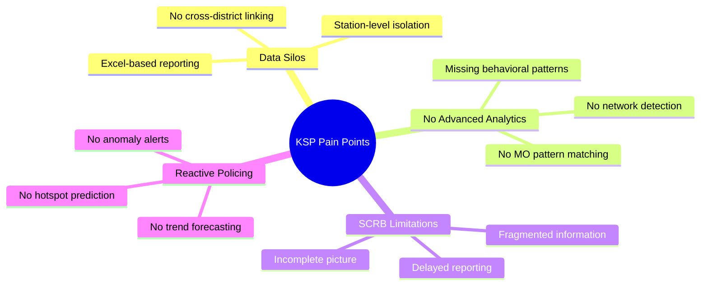

# 🔵 Crime Intelligence & Analytical Platform (Lumina)
### KSP Datathon 2026 — Karnataka State Police × Hack2Skill
**Track 2: AI-Driven Crime Analytics & Visualization Platform**
**Deployment: 100% Zoho Catalyst Native**

---

## Table of Contents

1. [Project Overview](#1-project-overview)
2. [Problem Analysis](#2-problem-analysis)
3. [Solution Architecture (Catalyst)](#3-solution-architecture-catalyst)
4. [Tech Stack](#4-tech-stack)
5. [Data Architecture & Schema](#5-data-architecture--schema)
6. [AI/ML Models Specification](#6-aiml-models-specification)
7. [Feature Breakdown](#7-feature-breakdown)
8. [Development Roadmap](#8-development-roadmap)
9. [Deployment Strategy](#9-deployment-strategy)
10. [Evaluation Alignment](#10-evaluation-alignment)

---

## 1. Project Overview

| Field | Details |
|---|---|
| **Platform Name** | Lumina (Crime Intelligence & Analytical Platform) |
| **Hackathon** | KSP Datathon 2026 — Hack2Skill |
| **Track** | Track 2 — AI-Driven Crime Analytics & Visualization |
| **Host** | Karnataka State Police (KSP) / SCRB |
| **Deployment Requirement**| **Zoho Catalyst (Mandatory)** |

### Vision Statement
> Transform the Karnataka State Police's fragmented, Excel-based crime records into a **real-time, AI-powered Strategic Intelligence Hub** deployed seamlessly on **Zoho Catalyst** — enabling proactive policing, network analysis, and spatiotemporal crime visualization.

---

## 2. Problem Analysis



---

## 3. Solution Architecture (Catalyst)

### 3.1 System Architecture Diagram

```mermaid
graph TB
    subgraph SOURCES["🗄️ Data Sources"]
        S1[FIR Records / CSV / Excel]
        S2[CCTNS Integration]
    end

    subgraph INGESTION["📥 Catalyst Ingestion & ETL"]
        I1[Catalyst Cron — Scheduled Syncs]
        I2[Catalyst Signals — File Upload Triggers]
        I3[Catalyst Serverless — Python ETL Functions]
    end

    subgraph STORAGE["🏛️ Catalyst Unified Storage"]
        DB1[(Catalyst Data Store\nRelational Data)]
        DB2[(Catalyst Stratus\nObject / Blob Storage)]
        DB3[(Catalyst Cache\nRedis-style caching)]
        DB4[(Neo4j on Catalyst AppSail\nNetwork Graph)]
    end

    subgraph AI["🤖 Catalyst AI / ML Engine"]
        M1[ST-DBSCAN on AppSail\nSpatiotemporal Hotspots]
        M2[Catalyst Zia AutoML\nPredictive Risk Scoring]
        M3[Catalyst Zia Services\nNER Text Analytics]
        M4[Catalyst QuickML\nLLM RAG & Knowledge Base]
    end

    subgraph BACKEND["⚙️ Catalyst Backend Services"]
        B1[Catalyst API Gateway]
        B2[Catalyst Authentication]
        B3[Catalyst Serverless Advanced I/O]
        B4[Catalyst SmartBrowz — PDF Engine]
        B5[Catalyst Push Notifications]
    end

    subgraph FRONTEND["🖥️ Analytics Platform"]
        F1[Catalyst Web Client Hosting]
        F2[React + Vite SPA]
        F3[Deck.gl — Geospatial Maps]
        F4[Cytoscape.js — Network Graph]
    end

    SOURCES --> INGESTION
    INGESTION --> STORAGE
    STORAGE --> AI
    AI --> BACKEND
    STORAGE --> BACKEND
    BACKEND --> FRONTEND
```



---

## 4. Tech Stack (Strict Catalyst Mapping)

| Standard Tech | Replaced By | Purpose in Lumina |
|---|---|---|
| React / Nginx | **Catalyst Web Client Hosting** | Hosting the SPA frontend |
| FastAPI / Docker | **Catalyst Serverless (Functions)** | Core backend REST API logic |
| Keycloak | **Catalyst Authentication** | User login, signup, RBAC |
| Kong API Gateway | **Catalyst API Gateway** | API routing, throttling, protection |
| PostgreSQL | **Catalyst Data Store** | Relational DB for FIRs, Suspects |
| MinIO / S3 | **Catalyst Stratus** | Object storage for raw CSVs and PDFs |
| Redis | **Catalyst Cache** | Fast query caching for dashboards |
| Apache Airflow | **Catalyst Cron / Job Scheduling** | Nightly batch processing |
| Apache Kafka | **Catalyst Signals** | Event-driven architecture (file uploads) |
| OpenAI / LangChain | **Catalyst QuickML (LLM/RAG)** | AI chat interface for natural language queries |
| spaCy | **Catalyst Zia Services** | Text analytics for FIR entity extraction |
| React-PDF | **Catalyst SmartBrowz** | Server-side PDF report generation |
| WebSockets | **Catalyst Push Notifications** | Real-time anomaly alerts |
| Docker / K8s | **Catalyst AppSail** | Running Neo4j and custom ML pipelines |

---

## 5. Data Architecture & Schema

### 5.1 Catalyst Data Store Schema (Relational)

**Tables:**
1. `District` (ID, Name, Code, Population)
2. `Police_Station` (ID, District_ID, Name, Jurisdiction_Area)
3. `FIR` (ID, Station_ID, FIR_Number, Date, Crime_Group, Lat, Lon, Narrative, Status)
4. `Accused` (ID, Name, DOB, Gender, Occupation, Arrest_Count)
5. `Victim` (ID, Name, DOB, Gender, Socioeconomic_Status)
6. `Case_Accused` (Mapping: FIR_ID, Accused_ID, Involvement_Type)
7. `Risk_Score` (ID, District_ID, Crime_Type, Score, Forecast_Date)

### 5.2 Neo4j Graph Schema (Hosted on AppSail)
Since network topology requires multi-hop recursive queries, Neo4j is deployed via Catalyst AppSail to run GraphSAGE link prediction.

```cypher
(:Suspect)-[:COMMITTED]->(:Incident)
(:Victim)-[:VICTIMIZED_IN]->(:Incident)
(:Incident)-[:OCCURRED_AT]->(:Location)
(:Suspect)-[:ASSOCIATED_WITH]->(:Suspect)
```

---

## 6. AI/ML Models Specification

### 6.1 Catalyst Zia & QuickML Integration

| Model | Catalyst Service | Input | Output |
|---|---|---|---|
| **Predictive Risk Scorer** | **Catalyst Zia AutoML** | Tabular historical density, time features | Risk score 0–100 per district |
| **NER Extractor** | **Catalyst Zia Services (Text)** | Raw FIR narrative text | Persons, locations, weapons |
| **Query Assistant** | **Catalyst QuickML (RAG)** | Natural language query | Structured response & SQL filter |
| **Hotspot Detector** | **AppSail (Python ML)** | (lat, lon, timestamp, crime_type) | ST-DBSCAN GeoJSON clusters |

---

## 7. Feature Breakdown

### Feature 1: State Overview Map
- **Technology**: Deck.gl `HeatmapLayer` on Catalyst Web Client Hosting.
- **Data**: FIRs fetched via Catalyst Serverless from Data Store.

### Feature 2: Hotspot Explorer (ST-DBSCAN Clusters)
- **Technology**: Deck.gl `PolygonLayer` with pulsing animation.
- **AI**: ST-DBSCAN running on AppSail; clusters served via API Gateway.

### Feature 3: Criminal Network Graph
- **Technology**: Cytoscape.js with Cose-Bilkent layout.
- **Data**: Neo4j queried via AppSail container.

### Feature 4: Predictive Risk Score Board
- **Technology**: ECharts heatmap grid.
- **AI**: Catalyst Zia AutoML forecasting crime risk for the next 7/14 days.

### Feature 5: AI Query Assistant
- **Technology**: Chat UI communicating with Catalyst QuickML.
- **Action**: Officers query "Show robbery trends in Mysuru" in natural language.

### Feature 6: One-Click Briefing Reports
- **Technology**: Catalyst SmartBrowz.
- **Action**: Instantly generates PDF reports of current dashboard state for offline field use.

---

## 8. Development Roadmap

### Sprint 1 — Catalyst Foundation (Days 1–2)
- [ ] Set up Zoho Catalyst Project via Catalyst CLI.
- [ ] Define schemas in **Catalyst Data Store**.
- [ ] Create synthetic data generator and upload to **Catalyst Stratus**.
- [ ] Configure **Catalyst Authentication** (RBAC roles).

### Sprint 2 — Core APIs & AI (Days 3–4)
- [ ] Write **Catalyst Serverless** functions (Advanced I/O) for CRUD operations.
- [ ] Deploy Neo4j Docker image to **Catalyst AppSail**.
- [ ] Integrate **Catalyst Zia Services** for NER on FIR texts.
- [ ] Setup **Catalyst QuickML** for the RAG chat assistant.

### Sprint 3 — Frontend (Days 5–6)
- [ ] Build React + Deck.gl application.
- [ ] Deploy to **Catalyst Web Client Hosting**.
- [ ] Integrate **Catalyst API Gateway** for secure frontend-backend communication.
- [ ] Implement Cytoscape.js network graphs.

### Sprint 4 — Polish & Demo (Days 7)
- [ ] Setup **Catalyst SmartBrowz** for PDF generation.
- [ ] Setup **Catalyst Cron** for scheduled ML updates.
- [ ] Prepare demo script ensuring every Catalyst service is highlighted to judges.

---

## 9. Deployment Strategy

The entire platform is deployed using the **Catalyst CLI** (`catalyst deploy`). No external cloud providers (AWS/GCP/Azure) are used, guaranteeing compliance.

```
project-root/
├── catalyst.json
├── client/                 # Deployed to Web Client Hosting
├── functions/
│   ├── api_service/        # Advanced I/O Serverless Function
│   └── etl_cron/           # Cron Function
└── appsail/
    ├── neo4j/              # Dockerfile for Graph DB
    └── ml_pipeline/        # ST-DBSCAN Python runtime
```

---

## 10. Evaluation Alignment

| Judging Criterion | Lumina Implementation | Catalyst Service Used |
|---|---|---|
| **Platform Integration** | 100% Zoho Catalyst native deployment | *All* |
| **Operational Usability** | One-click PDF reports for field officers | SmartBrowz |
| **AI/Analytics Quality** | Tabular forecasting & LLM querying | Zia AutoML, QuickML |
| **Data Handling** | Schema-based synthetic data generation | Data Store, Stratus |
| **Innovation** | GNN criminal network + spatial clustering | AppSail |
