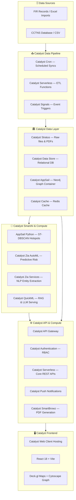
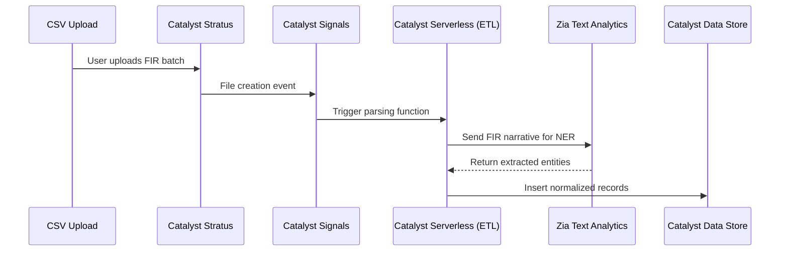

# 🔵 AI-Driven Crime Analytics & Visualization Platform
### Karnataka State Police (KSP) — Hackathon Solution Architecture
**Deployed 100% on Zoho Catalyst**

---

## Executive Summary

A cloud-native, AI-powered **Crime Intelligence & Analytical Platform (CIAP)** that transforms fragmented police records into an integrated strategic intelligence hub. This architecture strictly adheres to the KSP Datathon 2026 rules by deploying exclusively on **Zoho Catalyst**, utilizing Catalyst Serverless, AppSail, Data Store, and QuickML.

---

## 1. High-Level Architecture Overview (Zoho Catalyst)

---

## 2. Layered Architecture Breakdown

### Layer 1 — Data Ingestion & ETL

| Component | Catalyst Service | Purpose |
|---|---|---|
| Batch Scheduling | **Catalyst Cron** | Triggers nightly ETL jobs |
| Event Triggers | **Catalyst Signals** | Triggers parsing when new FIR CSV is uploaded |
| ETL Logic | **Catalyst Serverless** | Python functions to clean and normalize Excel data |

---

### Layer 2 — Data Storage Platform

| Store | Catalyst Service | What it Stores |
|---|---|---|
| **Relational Database** | **Catalyst Data Store** | Incidents, victims, offenders, lat/lon coords |
| **Object Storage** | **Catalyst Stratus** | Raw Excel files, exported PDF reports |
| **Graph Database** | **Catalyst AppSail (OCI)** | Neo4j container for criminal network analysis |
| **Caching Layer** | **Catalyst Cache** | Frequent dashboard queries |

> [!NOTE]
> Since Catalyst lacks a native Graph DB, **Neo4j** is deployed via a custom Docker container on **Catalyst AppSail**, ensuring compliance with the "Docker image deployment" capability.

---

### Layer 3 — AI / ML Intelligence Engine

| Capability | Catalyst Service | Implementation |
|---|---|---|
| **Hotspot Detection** | **AppSail (Python)** | ST-DBSCAN clustering using custom Python ML libraries. |
| **Predictive Risk Scoring** | **Catalyst Zia AutoML** | Tabular model forecasting crime risk per district. |
| **NLP on FIR Text** | **Catalyst Zia Services** | Text Analytics to extract Persons/Locations from narratives. |
| **LLM Query Assistant** | **Catalyst QuickML** | RAG pipeline allowing natural language querying of crime data. |
| **PDF Reports** | **Catalyst SmartBrowz** | Automated generation of crime hotspot reports. |

---

### Layer 4 — Backend Services

| Service | Catalyst Service | Responsibility |
|---|---|---|
| **API Routing** | **Catalyst API Gateway** | Rate limiting, routing to Serverless functions |
| **Core Business Logic** | **Catalyst Serverless** | Python-based Advanced I/O functions serving JSON |
| **Auth & Users** | **Catalyst Authentication** | Login, signup, and Role-Based Access Control (RBAC) |
| **Alerts** | **Catalyst Push Notifications** | Web push alerts for anomaly spikes |

---

### Layer 5 — Frontend Analytics Platform

| Feature | Technology | Hosting |
|---|---|---|
| SPA Framework | **React 18 + Vite** | **Catalyst Web Client Hosting** |
| Geospatial Maps | **Deck.gl + Mapbox GL JS** | (Client-side) |
| Network Graph | **Cytoscape.js** | (Client-side) |
| Charts & Dashboards | **Apache ECharts** | (Client-side) |

---

## 3. Data Flow Diagrams

### Real-Time FIR Ingestion Flow

---

## 4. Tech Stack Summary Table (Zoho Catalyst Native)

| Category | Technology / Catalyst Service |
|---|---|
| **Frontend Hosting** | Catalyst Web Client Hosting |
| **Frontend Framework** | React + Vite + Deck.gl + Cytoscape.js |
| **API Gateway** | Catalyst API Gateway |
| **Authentication** | Catalyst Authentication |
| **Compute / API Logic** | Catalyst Serverless (Advanced I/O Functions) |
| **Custom Containers** | Catalyst AppSail (Hosting Neo4j & ST-DBSCAN) |
| **Relational DB** | Catalyst Data Store |
| **Object Storage** | Catalyst Stratus |
| **Caching** | Catalyst Cache |
| **LLM / RAG** | Catalyst QuickML |
| **NLP** | Catalyst Zia Services (Text Analytics) |
| **Report Generation** | Catalyst SmartBrowz |
| **Job Scheduling** | Catalyst Cron |
| **Event Routing** | Catalyst Signals |

---

## 5. Differentiators vs. Non-Catalyst Submissions

By fully embracing the Zoho Catalyst ecosystem, this architecture guarantees **100% compliance** with hackathon deployment rules while maintaining enterprise-grade capabilities:

1. **AppSail for Graph Analytics**: Leveraging AppSail to run Neo4j ensures we don't lose powerful network mapping just because a native graph DB isn't available.
2. **Zia + QuickML Integration**: Replacing generic OpenAI calls with native Catalyst QuickML RAG ensures the intelligence layer is deeply integrated with the Catalyst Data Store.
3. **SmartBrowz Reporting**: Instantly generating PDF briefs for investigators using a native Catalyst service rather than clunky client-side generation.
